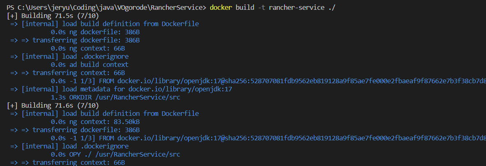

## Запуск сервисов с использованием Docker

Про используемые переменные окружения можно прочитать в [ENV_VAR.md](../docs/ENV_VAR/ENV_VAR.md)

Для всех сервисов необходимо определить подключение к базе данных с помощью описанных в файле выше переменных.

## HandymanService

[HandymanService Dockerfile](../HandymanService/Dockerfile)

1) Для запуска сервиса необходимо определить 2 переменные окружения **SERVER_PORT** и **GRPC_SERVER_PORT**.

2) Далее необходимо выполнить команду docker build -t <Название image'а> ./HandymanService

3) После выполнить docker run -p <Порт которые проброситься во вне>:<Порт определнный в **SERVER_PORT**> <Название image'а>

## LandscapeService

[LandscapeService Dockerfile](../LandscapeService/Dockerfile)

1) Для запуска необходимо определить 3 переменные окружения **SERVER_PORT**, **RANCHER_GRPC_SERVER_ADDRESS**, **HANDYMAN_GRPC_SERVER_ADDRESS**.

2) Далее необходимо выполнить команду docker build -t <Название image'а> ./LandscapeService

3) После выполнить docker run -p <Порт которые проброситься во вне>:<Порт определнный в **SERVER_PORT**> <Название image'а>

## RancherService

[RancherService Dockerfile](../RancherService/Dockerfile)

1) Для запуска сервиса необходимо определить 2 переменные окружения **SERVER_PORT** и **GRPC_SERVER_PORT**.

2) Далее необходимо выполнить команду docker build -t <Название image'а> ./RancherService

3) После выполнить docker run -p <Порт которые проброситься во вне>:<Порт определнный в **SERVER_PORT**> <Название image'а>

## VOgorode

**Запуск с использованием docker-compose**

1) Обновить или создать image'ы с использованием скрипта [build-images.bat](./scripts/build-images.bat) или [build-images.sh](./scripts/build-images.sh)

2) Для запуска приложения обязательным является переопределение **RANCHER_GRPC_SERVER_ADDRESS** и **HANDYMAN_GRPC_SERVER_ADDRESS** в сервисе LandscapeService.
В docker-compose они переопределены как 'rancher-service:9091' и 'handyman-service:9090' соответсвенно. 

3) После командой docker-compose up запустить сервис.

**Запуск с использованием Docker**

1) С использованием команды docker network create <Название сети> создать сеть к которой подключаться сервисы.

    
2) Затем при запуске контейнеров с сервисами необходимо использовать флаг --network <Название сети>. При таком запуске надо переопределить адреса gRPC серверов в LanscapeService как описано выше.
Если контейнер был запущен без подключения к сети использовать команду docker network <Название сети> <Название контейнера>

     
**Запуск без использования Docker**

1) Просто запустить сервисы как описано, используя вместо команды запуска Docker container'а (шага 3) java -jar ./<Название сервиса>/build/libs/<Название jar файла сервиса>.jar, а вместо команд сборки Docker image'а (шага 2) команду ./gradlew build.

